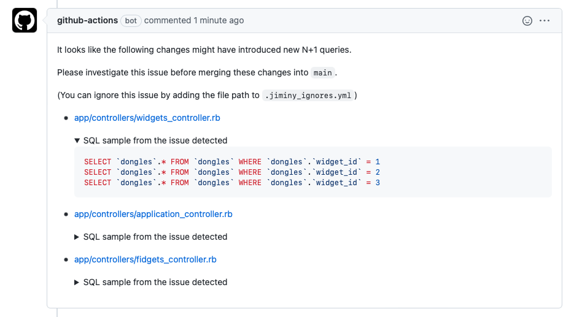

# Jiminy

## Your external conscience when creating pull requests

Jiminy wraps around your test suite and detects n+1 queries in your code.

Once your test suite has run, these can be reported in GitHub PR comments.

## How it works

Under the hood, Jiminy uses [Prosopite](https://github.com/charkost/prosopite) to detect N+1 queries.

When running RSpec tests, Jiminy extends Prosopite to log the n+1 instances it detects to a temp file (by default, `tmp/jiminy/results.yml`).

Via a command-line interface, Jiminy will then report these n+1 queries by commenting in the related PR on GitHub.

## How it looks



## Assumptions

Jiminy is still pre-release. The current version assumes the following:

- Your application is built in Ruby on Rails
- You are using RSpec as your test suite
- You are running your tests on CircleCI
- Your code repository is on GitHub

## Limitations

Since Jiminy works (via Prosopite) by monitoring DB queries made by the application in test mode, it's possible that your code might introduce a new n+1 that isn't detected. This is more likely if your test setup doesn't create multiple records. For example:

``` ruby
# in your controller ...
def index
  @users = User.all
  @users.each do |user|
    user.profile.name
  end
end

# in your test ...
before do
  @user = User.create(profile: Profile.new(name: "Profile name"))
end

it "loads the index" do
  get :index
  expect(response).to be_ok
end
```

This controller code will likely result in n+1 records being loaded from the DB, but since only one record is created in the test setup this probably won't be detected.

You can improve results by adding additional records in some of your test setups to better emulate a real-life scenario.

## Installation

### Installing the gem

Add the following to your test and development groups:

``` ruby
group :development, :test do
  gem "jiminy"
end
```

Then run the following command:

``` ruby
$ bundle exec jiminy init
```

## Configuration

The init command will add this file to your repo. Change the settings here to configure Jiminy:

``` ruby
# config/jiminy.rb
Jiminy.configure do |config|
  config.ci_workflow_name = "build_and_test"

  config.project_username = "bodacious"

  # NOTE: This is case sensitive on CircleCI
  config.project_reponame = "jiminy"

  config.circle_ci_api_token = ENV["CIRCLE_CI_API_TOKEN"]

  config.github_token = ENV["GITHUB_TOKEN"]

  # config.ignore_file_path =  File.join("./.jiminy_ignores.yml")

  # config.temp_file_location = File.join("./tmp/jiminy/results.yml")
end
```

_NOTE: This file must be named `config/jiminy.rb` or **the gem will not detect the configuration**._


### Running the CLI

``` bash
bundle exec jiminy report --commit b4742289dDDD364fd983fd57787dda74134acbaf --dry-run --pr-number=2 --poll-interval=5 --timeout=20
```

### CirleCI Config

Make sure your CircleCI configuration saves the artifacts created when running your test suite:

```yaml
# ...
- store_artifacts:
    path: ./tmp/jiminy
# ...
```

### GitHub Actions

Call the Jiminy CLI from a GitHub action:

```yaml
- name: Report N+1 issues
  env:
  CIRCLE_CI_API_TOKEN: ${{ secrets.CIRCLE_CI_API_TOKEN }}
    GITHUB_TOKEN: ${{ secrets.GITHUB_TOKEN }}
    PR_NUMBER: ${{ github.event.number }}

  run: |
    bundle exec jiminy report --commit ${{ github.event.pull_request.head.sha }} --pr-number=$PR_NUMBER --poll-interval=15 --timeout=300
```

## Ignoring instances

If you're adding Jiminy to an existing app, you might want to silence some of the existing warnings and focus on preventing new n+1s being introduced.

You can do this by creating a file in your application's directory called `.jiminy_ignores.yml` and listing the files you wish to ignore:

```yaml
---
- app/controllers/application_controller.rb
- app/models/user.rb
# - etc.
```

## How to run the test suite

Jiminy testing is still fairly sparse. To run the existing tests use:


``` bash
$ rspec spec
```

or

``` bash
$ rake
```

## Contributing

Bug reports and pull requests are welcome on GitHub at https://github.com/bodacious/jiminy.
